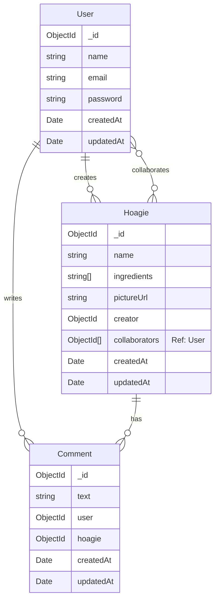
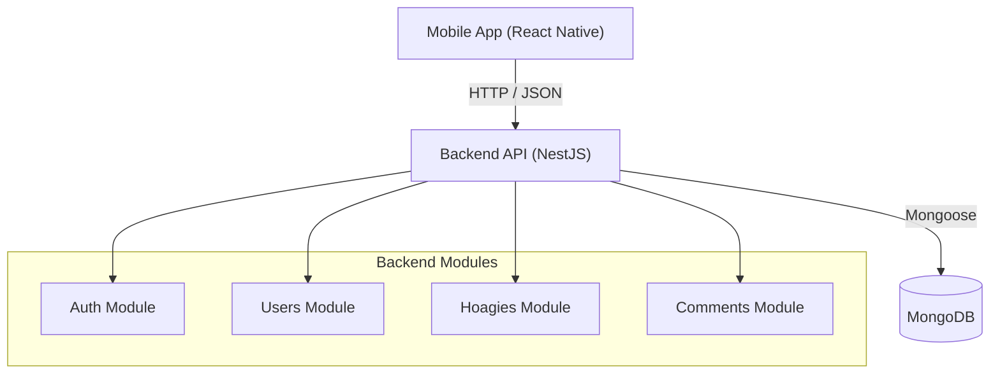

# System Architecture

## Database Schema

## System Architecture

## Implementation Details

- **Backend Framework:** NestJS with Mongoose.
- **Frontend Framework:** React Native with Expo.
- **Authentication:** JWT (JSON Web Tokens).
- **Search:** Regex-based email search for users.
- **Collaboration:** Users can be added as collaborators to Hoagies.
- **Rate Limiting:** `ThrottlerModule` protects API endpoints.
