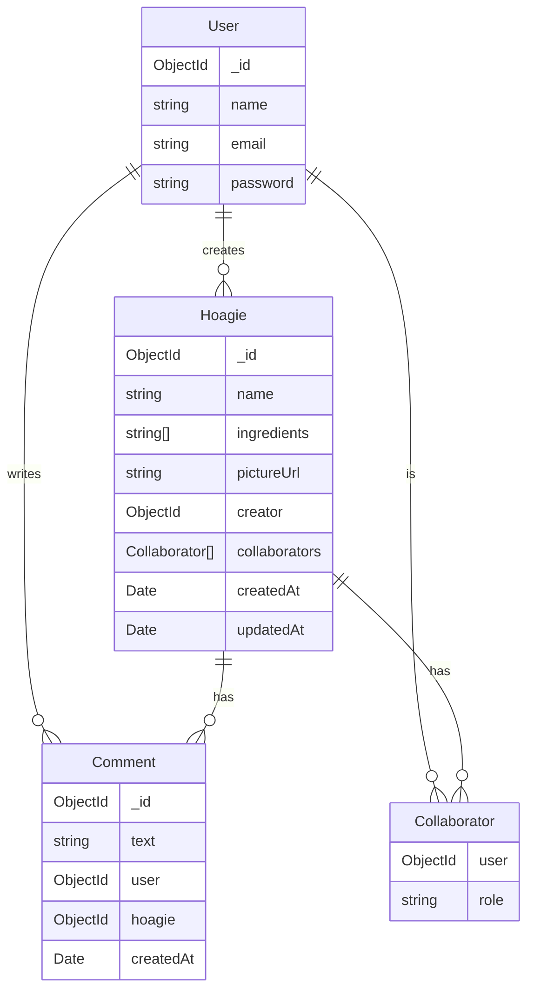

# System Architecture

## Database Schema



## System Architecture

```mermaid
graph TD
    Client["Mobile App (React Native)"]
    API[Backend API (NestJS)]
    DB[(MongoDB)]

    Client -->|HTTP / JSON| API
    API -->|Mongoose| DB

    subgraph "Backend Modules"
        Auth[Auth Module]
        Users[Users Module]
        Hoagies[Hoagies Module]
        Comments[Comments Module]
    end

    API --> Auth
    API --> Users
    API --> Hoagies
    API --> Comments
```

## Implementation Details

- **Backend Framework:** NestJS with Mongoose.
- **Frontend Framework:** React Native with Expo.
- **Authentication:** JWT (JSON Web Tokens).
- **Search:** Regex-based email search for users.
- **Collaboration:** Users can be added as collaborators to Hoagies.
- **Rate Limiting:** `ThrottlerModule` protects API endpoints.
